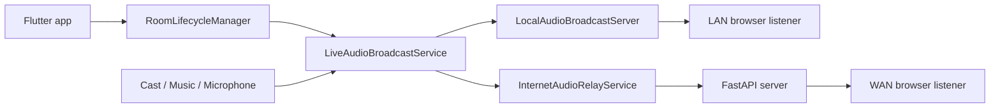

# SyncWave

SyncWave is a local-first synchronized audio app. A host creates a room over
LAN, internet, or both; listeners open a browser page; the room keeps a
continuous 48 kHz PCM timeline so people can join before the source starts.

- **Version**: `1.1.5`
- **App ID**: `git.opencodequark.syncwave`
- **Source**: <https://github.com/OpenCodeQuark/syncwave>
- **Default WAN server**: `wss://syncwave.rajujha.dev`

## Features

- Android LAN/WAN hosting with system audio capture on Android 10+.
- Android/iOS microphone hosting and local Music-to-room routing.
- Browser listeners through `/stream/join` with Web Audio synchronization.
- Optional FastAPI WAN relay with listener-only auth support.
- Room PINs for listener joins and Server Connection PINs for host/relay actions.
- LAN JSON/base64 compatibility plus optional binary PCM WebSocket frames.
- Browser QR/link sharing from Lobby and Live Room screens.

## Architecture



LAN rooms are served directly from the host device. WAN rooms use the FastAPI
server for room metadata, signaling, and PCM relay. Redis is optional status
plumbing only; room and socket state are process-local.

## Setup

### Flutter app

```sh
cd apps
flutter pub get
dart run build_runner build --delete-conflicting-outputs
dart format .
flutter analyze
flutter test
flutter build apk --release
```

Use a physical Android 10+ device for system-audio validation. Emulators do not
represent `AudioPlaybackCapture` behavior reliably.

### WAN server

```sh
cd server
python -m venv .venv
.venv/bin/python -m pip install -r requirements.txt
.venv/bin/python -m uvicorn app.main:app --host 0.0.0.0 --port 8000
```

Main endpoints: `GET /`, `GET /health`, `GET /status`, `POST /rooms`,
`GET /rooms/{room_id}`, `GET /stream/join`, and `WS /ws`.

Docker:

```sh
docker compose up --build signaling-server
docker compose --profile redis up
```

For production, set a real `PIN_HASH_SECRET`, enable
`REQUIRE_SERVER_CONNECTION_PIN` when hosts should be protected, terminate TLS
for HTTPS/WSS, and use sticky sessions or shared state before scaling beyond
one process.

## Release Builds

GitHub Releases are built by [`.github/workflows/flutter-release.yml`](.github/workflows/flutter-release.yml):

- **Signed APK** when all four Android signing secrets are configured (see [workflow docs](.github/workflows/README.md)).
- **Unsigned APK** (debug signing) when secrets are missing — the workflow still publishes artifacts with a clear warning.

F-Droid artifacts use [`.github/workflows/fdroid-release.yml`](.github/workflows/fdroid-release.yml) with Gradle `-Psyncwave.fdroid=true` (no app-side release signing). Store metadata: `fastlane/metadata/android/en-US/`.

Signing secrets must be under **Settings → Secrets and variables → Actions** (repository secrets), not Agents secrets. See [`.github/workflows/README.md`](.github/workflows/README.md).

## Platform Notes

- Android is the primary host platform.
- iOS can host microphone and Music, but not system-wide audio.
- Browser listeners are the production listener path.
- Native in-app PCM listener playback is scaffolded but not enabled.
- WAN transport is still PCM16/base64 JSON; LAN can negotiate binary PCM.
- FastAPI rooms are in-memory per process.

## Changelog

See [CHANGELOG.md](CHANGELOG.md).

## License

[MIT](LICENSE)
